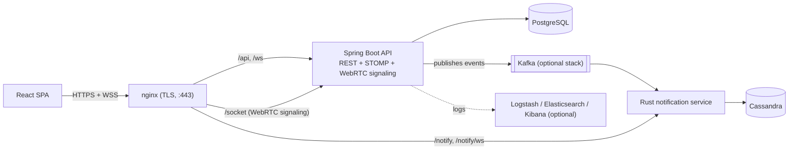
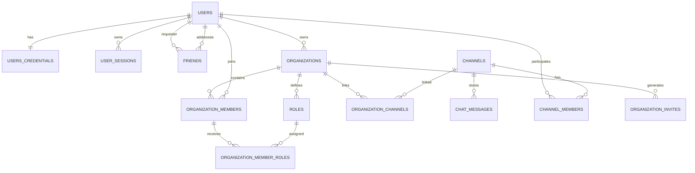

# Anteiku

Anteiku is a real-time chat platform — servers, channels, DMs, friends, roles and permissions, voice calls, and push notifications, built from scratch as a team of three.


- **Frontend:** React 19 + TypeScript, Tailwind CSS
- **Backend:** Java 25, Spring Boot 4, an OpenAPI-generated REST API
- **Real-time:** STOMP over WebSocket for chat/presence, raw WebSocket + WebRTC for voice
- **Notifications:** a separate Rust service consuming Kafka and writing to Cassandra
- **Data:** PostgreSQL
- **Ops:** Docker Compose, nginx (TLS termination + reverse proxy), an optional ELK stack for logs

## Why this exists

We wanted to build something with the shape of a real product rather than a toy CRUD app: multiple independently-scalable pieces (a Java API, a Rust notification engine, a message broker, two different databases) that all have to agree with each other over the wire.

## Architecture



The core stack (`docker-compose.yaml`) is nginx, the frontend, the backend, and Postgres — that's enough to run the whole app. Kafka, Cassandra, and the notification service live in their own compose file under [`Tools/Notify`](Tools/Notify) and are opt-in (see [Running the notification pipeline](#running-the-notification-pipeline)). Voice call audio/video never touches the backend at all — once signaling exchanges SDP/ICE over a WebSocket, peers connect to each other directly (mesh WebRTC, one `RTCPeerConnection` per participant).

## Features

- **Auth** — email/password with JWT access tokens (HS256, httpOnly cookies) backed by a server-side, revocable refresh token, plus OAuth2 login via GitHub and Google.
- **Profiles** — editable display name/status/about, avatar upload through Cloudinary.
- **Friends** — requests, accept/remove, block/unblock, live online status.
- **Servers & channels** — create/join via invite code, text and voice channels, per-server roles built on a permission bitmask (administrator, manage channels, manage roles, send messages, connect to voice).
- **Chat** — real-time messaging over STOMP, paginated history, presence pushed over the same socket.
- **Voice calls** — join/create voice rooms, mesh WebRTC with STUN-based connectivity.
- **Notifications** — the backend publishes domain events to Kafka; the Rust service consumes them and pushes to clients over its own WebSocket. Currently wired end-to-end for DMs and voice-call invites — server/group-channel notifications are modeled but not emitted yet.
- **Internationalization** — full English, Russian, and German translations with a language switcher.
- **API docs** — an OpenAPI 3.1 spec (31 paths, 40 operations) with generated server interfaces, browsable via Swagger UI at runtime.
- **Observability** — an optional ELK stack with index lifecycle policies and a prebuilt Kibana dashboard.

## Running it

### Prerequisites

- Docker Engine 24+ and Docker Compose v2
- GNU Make
- Node.js 20.x + npm 10+ (for local frontend dev)
- JDK 25 (for local backend dev — the Maven Wrapper is bundled)

### Setup

```bash
cp .env.example .env
```

Fill in `.env`:

| Variable | Used for |
|---|---|
| `POSTGRES_DB`, `POSTGRES_USER`, `POSTGRES_PASSWORD` | Postgres |
| `JWT_SECRET`, `JWT_EXPIRATION` | Signing/expiry for access tokens |
| `GITHUB_CLIENT_ID`, `GITHUB_CLIENT_SECRET` | GitHub OAuth2 login |
| `GOOGLE_CLIENT_ID`, `GOOGLE_CLIENT_SECRET` | Google OAuth2 login |
| `CLOUDINARY_CLOUD_NAME`, `CLOUDINARY_API_KEY`, `CLOUDINARY_API_SECRET` | Avatar/image uploads |
| `REACT_APP_STUN_SERVER`, `REACT_APP_SIGNALING_SERVER` | WebRTC voice calls |
| `NOTIFY_PROD_ADDR` | Notification service address |
| `ELASTIC_PASSWORD`, `KIBANA_PASSWORD` | Optional ELK stack |

### Run with Docker

```bash
make up          # frontend + backend + postgres + nginx
make up-elk       # same, plus the ELK logging stack
make down         # stop
make down-elk     # stop, including ELK
```

### Running the notification pipeline

Kafka, Cassandra, and the Rust service are a separate opt-in stack:

```bash
docker compose -f docker-compose.yaml -f Tools/Notify/docker-compose.make.yaml up
```

See [`Tools/Notify/README.md`](Tools/Notify/README.md) for running it standalone.

### Local development

**Backend**

```bash
cd Backend
./mvnw clean verify
./mvnw spring-boot:run
```

**Frontend**

```bash
cd Frontend/app_react
npm install
npm test -- --watchAll=false
npm start
```

### Ports

| Service | Port |
|---|---|
| Frontend | 3000 |
| Backend API | 8080 |
| Backend remote debug | 5005 |
| PostgreSQL | 5432 |
| nginx (TLS) | 443 |

Optional notification stack: Kafka `9092`, Cassandra `9042`, notify REST `6161`, notify WebSocket `8088`.
Optional ELK stack: Logstash input `50000`; Elasticsearch/Kibana are reachable through nginx on `9200`/`5601`.

## API & data model

- OpenAPI spec: [`Backend/src/main/resources/static/openapi.yaml`](Backend/src/main/resources/static/openapi.yaml), with generated server interfaces implemented by hand-written delegates.
- Swagger UI is served at runtime via Springdoc.
- Endpoint groups: auth, users, friends, organizations (servers), organization members, roles, channels, invites, chat, voice, notifications.

The relational schema lives in [`Backend/docker-entrypoint-initdb.d/init.sql`](Backend/docker-entrypoint-initdb.d/init.sql):



Channels are `TEXT` or `VOICE`; DM channels are just channels with no organization attached. Permissions are a bitmask on `roles.permission_mask`, evaluated per-user as the OR of all their roles (an organization's owner always has full permissions).

## Testing

**Backend** — Mockito-based unit tests over auth, sessions, OAuth2 provisioning, JWT handling, and each domain service (channels, chat, friends, organizations, roles, users). No controller-level or full integration tests yet.

**Frontend** — Jest + Testing Library over the auth forms, the friends UI, the API client's refresh-token interceptor, and the WebRTC signaling session.

```bash
cd Backend && ./mvnw test
cd Frontend/app_react && npm test -- --watchAll=false
```

## Tech stack

**Frontend:** React 19, TypeScript, react-router-dom, i18next/react-i18next, `@stomp/stompjs`, Tailwind CSS, Jest + Testing Library.

**Backend:** Java 25, Spring Boot 4, Spring Security + OAuth2 client, Spring Web/WebSocket, Spring Data JPA + Hibernate, Spring Kafka, OpenAPI Generator + Springdoc, jjwt.

**Data & messaging:** PostgreSQL, Apache Kafka, Apache Cassandra.

**Other:** Rust/Cargo (notification service), Cloudinary, the ELK stack, Docker Compose.

## Team

Built by [**fraumarzhuk**](https://github.com/fraumarzhuk), [**grysha11**](https://github.com/grysha11), and [**Db1zz**](https://github.com/Db1zz):

**fraumarzhuk** — Frontend lead, with backend/auth contributions
- Login/signup pages, `MainLayout`, navigation, the chat UI, the profile popup/edit forms, and the friends views (PRs #9, #10, #17, #23, #25, #27, #34, #36, #49, #55, #56).
- The chat backend (#29), oauth2 integration (#17) and contributions to the Spring Security/auth layer.
- Internationalization and the language switcher (#40).

**grysha11** — Full-stack development + DevOps
- Servers/channels/roles, frontend and backend (#42, #43, #45, #48, #51), the friends backend integration (#28), and the profile button/friends view frontend (#14, #16).
- CI/CD (#41), the ELK observability stack (#35), the Makefile and second `docker-compose` file for the notification stack (#37), and nginx as reverse proxy + TLS termination (#54).
- The backend Mockito test suite (#38) and the frontend Jest/Testing Library suite (#39), plus a later pass of tests and translations (#57).

**Db1zz** — Backend/infra lead
- Project scaffolding: the initial commit, initial backend structure, the `User` model, and the Postgres init scripts, before the team moved to a PR-based workflow.
- Auth end-to-end: OpenAPI/Swagger plus registration endpoints (#8), the JWT tokenizer (#11), auth fixes (#20), and a later round of security upgrades (#26).
- The voice pipeline: WebRTC calls and supporting DB tables (#33), the complete voice call system (#46), the server voice-channel participants view (#50), and the STOMP socket for presence/session management (#47).
- The standalone Rust notification service under [`Tools/Notify`](Tools/Notify) (Kafka consumer, Cassandra writer, its own REST/WebSocket API), integrated with the backend (#44), plus live organization-member status updates (#52) and a voice-notification bug fix (#53).

## Resources

- [Spring Boot Documentation](https://docs.spring.io/spring-boot/documentation.html)
- [Spring Security OAuth2 Client](https://docs.spring.io/spring-security/reference/servlet/oauth2/)
- [Spring WebSocket/STOMP](https://docs.spring.io/spring-framework/reference/web/websocket.html)
- [React Documentation](https://react.dev/)
- [i18next Documentation](https://www.i18next.com/)
- [OpenAPI Specification](https://spec.openapis.org/oas/latest.html)
- [Apache Kafka Docs](https://kafka.apache.org/documentation/)
- [Apache Cassandra Docs](https://cassandra.apache.org/doc/)
- [Rust Book](https://doc.rust-lang.org/book/)
- [Elastic Stack Docs](https://www.elastic.co/guide/index.html)
